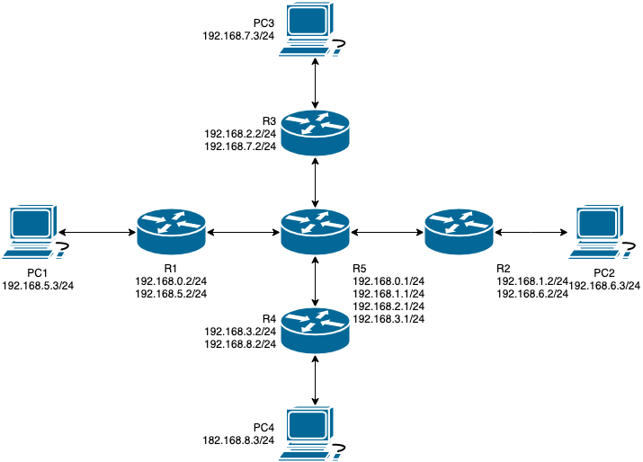

# 实验评测技术方案

至此，实验者应当已经全面完成硬件路由器的全部软硬件设计与实现，本节阐述本实验评测的具体技术方案。实验评测将会充分测试实验者路由器的如下功能和性能指标：

* 连通性：接入路由器的主机之间两两连通
* 吞吐率
* （小包）转发速率
* 路由表容量

值得注意的是，实际路由器的如下特性也同样重要，但在本实验中暂不进行测试：

* 路由表更新速率：全网路由表在按一定的速率持续更新，因此路由器需要支持
* 路由器软件的内存安全问题，以及其他安全问题
* 其他功能和性能指标

后文将实验者路由器称为被测路由器。

## 单路由器功能与性能测试

本小节测试单路由器的功能（转发正确性）以及性能（转发表容量、转发速率及吞吐率），测试流程为：

首先，将被测路由器四个接口的 IP 地址按下表所示配置。MAC 地址由实验者选定（下同），但需要注意每台被测路由器的每个接口的 MAC 地址应当各不相同。

| 接口 | IP 地址       |
| ---- | ------------- |
| 0    | `10.0.0.1/24` |
| 1    | `10.0.1.1/24` |
| 2    | `10.0.2.1/24` |
| 3    | `10.0.3.1/24` |

网络测试仪以及测试主机的 IP 地址相应配置。

将被测路由器四个接口与网络测试仪四个接口两两相连，然后进行如下测试：

* 转发正确性及路由表容量：给定一张路由表，在网络测试仪的所有接口上运行标准 RIP 路由协议，网络测试仪向被测路由器的对应接口广播路由信息，同时在所有接口接收被测路由器广播的路由信息。通过将收到的路由信息与网络测试仪最初广播的路由信息比较，可以初步判断被测路由器能否接受该路由表。进一步，对于路由表中每一条路由，网络测试仪在该路由的网络前缀中随机选择 1 个 IP 地址，生成目标 IP 地址为该地址的 IP 分组，并向被测路由器的不同接口发送，然后尝试从该路由的下一跳接口接收这一 IP 分组。若成功接收，说明被测路由器能够正确转发目标 IP 地址为该网络前缀的 IP 分组。若被测路由器能够转发该路由表中所有网络前缀对应的 IP 分组，认为被测路由器能够正确接受该路由表。通过改变给定路由表的大小，即可测试被测路由器能够接受的最大的路由表，其大小认定为被测路由器的路由表容量。
* （小包）转发速率：给定一张恰好占满被测路由器的路由表（即大小为被测路由器路由表容量的路由表），在网络测试仪的所有接口上运行标准 RIP 路由协议。此时，给定 IP 分组大小，网络测试仪同时向被测路由器所有接口连续不断发送该大小的测试 IP 分组。其中，每个测试 IP 分组的目标 IP 地址随机生成，并确保所有接口的测试 IP 分组不会在被测路由器的任何一个出接口拥塞。发送时，网络测试仪分别记录每个接口的统计信息，包括发送字节数及发送分组数。同时，网络测试仪从被测路由器所有接口接收 IP 分组并进行正确性校验，并分别记录每个接口的统计信息，包括接收正确字节数、接收正确分组数及接收错误分组数。此外，网络测试仪记录测试的持续时间。所有接口每秒接收正确的分组数之和认定为该分组大小下的转发速率。通过改变分组大小，绘制“IP 分组大小—转发速率”图线。IP 分组大小为 46 字节时的转发速率认定为被测路由器的小包转发速率。

将被测路由器四个接口与测试主机 0 、测试主机 1 、测试主机 2 及测试主机 3 （这四个测试主机可用 Linux 网络命名空间模拟）分别相连，然后进行如下测试：

* 吞吐率：将四个测试主机的 TCP 拥塞控制算法配置为 CUBIC 算法，并同时在四个测试主机分别运行 `iperf3 -s` 。然后，同时在测试主机 0 运行 `iperf3 -c 10.0.1.2 -t 12 -O 2` ，在测试主机 1 运行 `iperf3 -c 10.0.0.2 -t 12 -O 2` ，在测试主机 2 运行 `iperf3 -c 10.0.3.2 -t 12 -O 2` 以及在测试主机 3 运行 `iperf3 -c 10.0.2.2 -t 12 -O 2` 。该四个 iperf3 客户端报告的带宽之和认定为被测路由器的吞吐率。

若被测路由器的小包转发速率达到或超过 5.95Mpps ，且吞吐率达到或超过 3.76Gbps ，则认定该被测路由器能够线速转发。

此外，网络测试仪保证将整个路由表分散在其发送定时器的整个周期内均匀发送，防止发送过快导致被测路由器无法及时处理。

## 组内互联互通测试

本小节测试相同实现的 3 个路由器的互联互通性（如是否能正确交换路由信息，或是否能连续逐跳转发），测试流程为：

将 3 个相同的被测路由器按照？？？互相连接，然后将这些被测路由器四个接口的 IP 地址按下表所示配置：

| 被测路由器编号 | 接口 | IP 地址       |
| -------------- | ---- | ------------- |
| 0              | 0    | `10.0.0.1/24` |
| 0              | 1    |               |
| 0              | 2    |               |
| 0              | 3    |               |
| 1              | 0    |               |
| 1              | 1    |               |
| 1              | 2    |               |
| 1              | 3    |               |
| 2              | 0    |               |
| 2              | 1    |               |
| 2              | 2    |               |
| 2              | 3    |               |

## 组间互联互通测试

本小节的测试流程为：

以下作废：

功能及性能测试方法：

1. 连通性：PC1-4 两两之间可以互相 `ping` 通。
2. 单连接单工：在 PC1 运行 `iperf3 -s`，在 PC2 运行 `iperf3 -c 192.168.5.3`，其余参数默认。
3. 双连接单工：在 PC2 运行 `iperf3 -s`，在 PC3 运行 `iperf3 -s`，同时在 PC1 运行 `iperf3 -c 192.168.6.3` 和在 PC4 运行 `iperf3 -c 192.168.7.3`，其余参数默认。
4. 双连接双工：在 PC1-4 运行 `iperf3 -s`，同时在 PC1 运行 `iperf3 -c 192.168.6.3` ，在 PC2 运行 `iperf3 -c 192.168.5.3` ，在 PC3 运行 `iperf3 -c 192.168.8.3` ，在 PC4 运行 `iperf3 -c 192.168.7.3`，其余参数默认。
5. （小包）转发速率：TODO：需要使用网络测试仪测试。
6. 小规模路由表容量测试：在 R1 上额外配置 192.168.10.0/24 ~ 192.168.255.0/24 共 246 条新的路由，保证 RIP 协议运行的正确性。
7. 中等规模路由表容量测试：在 R1 R2 R3 R4 上分别配置 10.1.0.0/24 ~ 10.2.255.0/24，10.3.0.0/24 ~ 10.4.255.0/24，10.5.0.0/24 ~ 10.6.255.0/24，10.7.0.0/24 ~ 10.8.255.0/24 共 2048 条新路由，保证 RIP 协议运行和转发功能的正确性。
8. 较大规模路由表容量测试：在 R1 上配置 AS4538 的所有 IPv4 路由（约 5000 条），保证 RIP 协议运行和转发功能的正确性。

在 `SetupJoint` 目录下还有用于测试以上各项的脚本 ，执行前需要执行 `./setup.sh` 以配置环境，然后在 tmux 之外运行 `./part[1-8].sh` 以测试各个阶段。此外，`./disable.sh` 会关闭 BIRD 的额外的路由表， `./restart.sh` 会重启 BIRD 。

测试流程：

1. 在 tmux 之外运行 `./setup.sh` ，检查 eno1-4 是否分别出现在 R1-4 的 netns，如果不在就在 tmuc 之外再次运行 `./setup.sh` 。
2. 在 tmux 之外按顺序运行 `./part{1,2,3,4,5}.sh` 进行测试，每个 part 都可以多次运行。
3. 对于路由表的测试，可以运行 `./part{6,7,8}.sh` 在 BIRD 中开启对应的路由表，用 `./disable.sh` 关掉额外的路由表，用 `./restart.sh` 重启 BIRD 。测试过程中，可以通过重启 BIRD 来保证上一阶段的路由表都已经过期。

!!! note "注意事项"

    1. tmux 使用方法网上可查，没有修改配置。
    2. Shell 提示符中会显示当前的 netns 。
    3. 部分脚本需要在 tmux 外运行。

